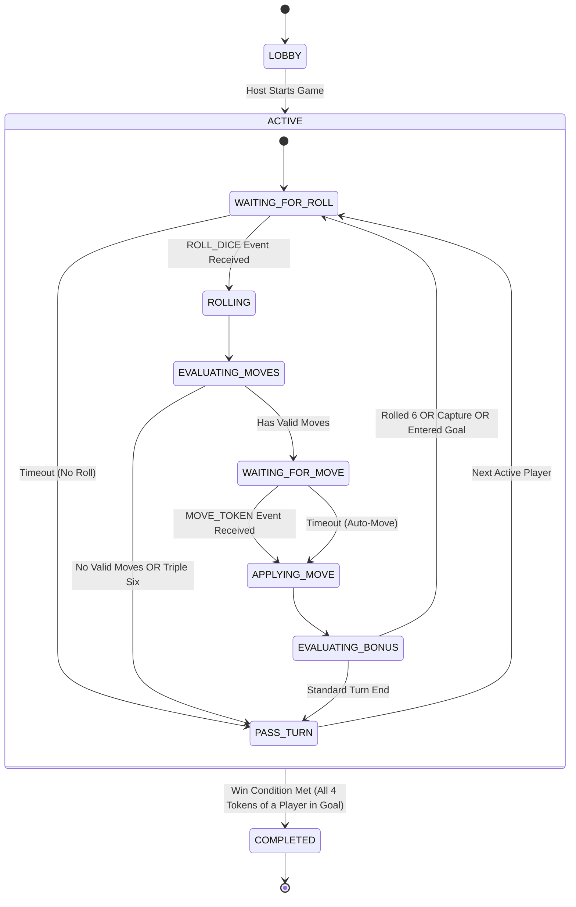
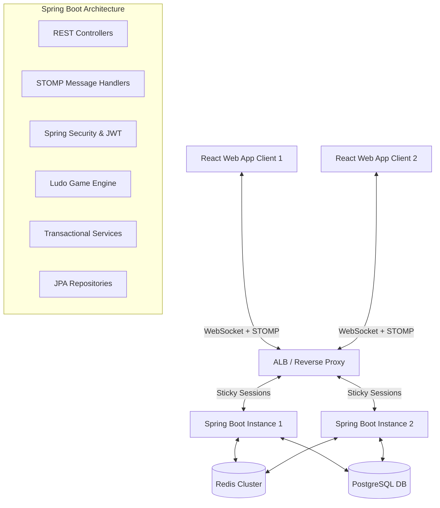
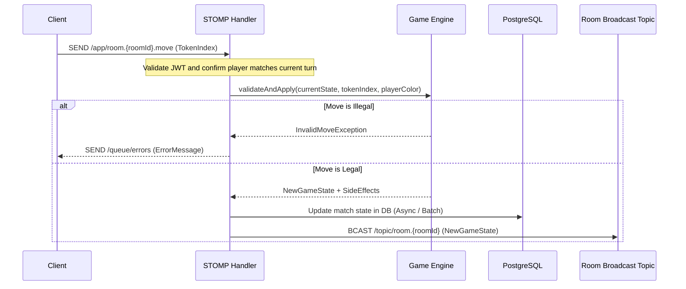

# Software Requirements Specification (SRS) & Architecture Design
## Project: Scalable Real-Time Multiplayer Ludo Game
**Document Version:** 1.0.0  
**Status:** DRAFT / PROPOSED  

---

## 1. Project Overview

### 1.1 Executive Summary
This document defines the complete system architecture, database design, API specification, WebSocket event protocols, and implementation plan for a production-grade, real-time, web-based multiplayer Ludo game application. The platform is designed to support three core modes: Local pass-and-play, Single-player vs. Heuristic AI, and Online real-time multiplayer with private invite codes. The system utilizes a server-authoritative model to prevent cheating, maintain synchronization, and manage lobby lifecycles.

### 1.2 Objectives
*   **Scalability:** Design a stateless backend API tier and stateful, memory-optimized WebSocket session clusters capable of supporting thousands of concurrent active matches.
*   **Low Latency & High Fidelity:** Real-time state synchronization via WebSocket + STOMP with latency under 100ms for active turns.
*   **Security & Integrity:** Mitigate client-side tampering through server-side game rules validation, JWT authentication, and secure socket handshakes.
*   **Seamless User Experience:** Enable automatic session reconnection, state recovery, and graceful degradation during network interruptions.

### 1.3 Target Audience
*   **Casual Gamers:** Seeking instantaneous match creation or pass-and-play local matches.
*   **Friend Groups:** Utilizing private lobby codes to play together remotely.
*   **Competitive Players:** Interested in tracking historical stats, climbing the global leaderboard, and analyzing match performance.

### 1.4 Technical Goals
*   Separate frontend UI rendering from core game-loop logic.
*   Implement a pure, side-effect-free Game Engine on the backend that validates all moves deterministically.
*   Deploy a highly responsive, animated board layout on the client side using React, Tailwind CSS, and Canvas/SVG rendering.

---

## 2. Core Features

### 2.1 Local Multiplayer
*   **Mechanics:** Supports 2 to 4 players on a single device using a pass-and-play model.
*   **Configuration:** Customization options for player names, color assignment (Red, Green, Yellow, Blue), and optional rule toggles (e.g., whether a kill is required before entering the home path).
*   **Offline Persistence:** Game state is persisted locally inside the client's Web Storage (`localStorage`) at the end of every turn, allowing the game to survive page reloads or tab closures.

### 2.2 AI Mode
*   **Basic AI Engine:** Employs a heuristic-based decision engine. The AI evaluates all legal moves for its active tokens on a turn and scores them using a weighted utility function:
    $$\text{Utility} = w_1 \cdot \text{KillOpportunity} + w_2 \cdot \text{EnterHomeGoal} + w_3 \cdot \text{EscapeDanger} + w_4 \cdot \text{ProgressToHome} - w_5 \cdot \text{EnterDangerZone}$$
*   **Future AI Extensions:** Prepared hooks for Minimax search with alpha-beta pruning (3-4 ply depth taking into account dice probabilities) and integration with reinforcement learning agents.

### 2.3 Online Multiplayer
*   **Room Lifecycle:** Users can instantiate private game lobbies. Upon initialization, the server generates a cryptographically secure, high-entropy 6-character alphanumeric Invite Code (e.g., `G7K9XP`) mapped to the Redis/Memory room registry.
*   **Join Mechanics:** Peers join rooms by submitting the invite code. The room transitions through states: `LOBBY` $\rightarrow$ `PRE_START` $\rightarrow$ `ACTIVE` $\rightarrow$ `COMPLETED`.
*   **Reconnection Handling:**
    *   If a client disconnects, the server marks the player's status as `DISCONNECTED` but does not destroy the room or skip their turns immediately.
    *   A grace period of 60 seconds is granted. If the client reconnects via WebSocket using their active JWT and matches the `roomId` and `playerId`, they receive the complete serialized game state (full state sync) and resume play.
    *   If the grace period expires, the player is either replaced by an AI bot or marked as auto-resigned, based on room-specific settings.
*   **Synchronization Model:**
    *   Every action (Roll, Move) is validated by the server.
    *   The server broadcasts delta-updates containing the modified state (dice value, token movements, next turn) and a logical clock sequence number to prevent out-of-order execution.
*   **Anti-Cheat Validation:** The client has zero authority over token positions, dice values, or turn order. Every user action is a *request* evaluated by the backend Game Rules Engine. Any illegal move request results in a socket error message and a force-sync payload sent to the violating client.

### 2.4 Authentication
*   **Identity Provisioning:** Email-based registration with password hashing using BCrypt (work factor 12).
*   **JWT Handshake:** 
    *   Access Token: Short-lived (15 minutes), passed in the HTTP `Authorization` header (`Bearer <token>`) for REST endpoints, and as a query parameter during the initial WebSocket upgrade request.
    *   Refresh Token: Long-lived (7 days), stored in an HTTP-only, secure, SameSite=Strict cookie.
*   **Route Protection:** React Router DOM layouts using higher-order guard components that redirect unauthenticated traffic to `/login` while preserving the intended target URL.

### 2.5 Dashboard & Profile Management
*   **Player Statistics:** Displays aggregate data including total matches played, win/loss ratio, average turn duration, total kills achieved, and heatmaps of token captures.
*   **Match History:** Paginated list of historical games, detailing match duration, final rank, player colors, and changes in player rating (MMR).
*   **Leaderboards:** Dynamically calculated global and regional rankings based on Elo/MMR rating.
*   **Profile Customization:** Management of display names, avatars, and UI theme preferences (Dark/Light/Glassmorphism).

---

## 3. Game Rules Engine

The game engine is designed as a deterministic state machine, ensuring consistency across all players.

### 3.1 Board Map & Coordinate System
The Ludo board consists of a track of 52 common cells, 4 color-specific home paths of 5 cells each, and 4 home goals.
*   **Global Track Index:** `0` to `51` arranged clockwise.
*   **Base (Yard):** State indicating a token is not yet on the active track.
*   **Home Path Index:** `52` to `56` (relative representation per color).
*   **Home Goal:** `57` (terminal position).

```
                      [Global Track (52 cells)]
               +--------------------------------------+
               |                                      |
       [Red Base] ---> [Red Start (0)]                |
               |             |                        |
               |       [Red Home Path (52-56)]        |
               |             |                        |
               |             v                        |
               |      [HOME GOAL (57)] <--- [Yellow Path] <--- [Yellow Base]
               |             ^                        |
               |             |                        |
               |     [Blue Home Path]                 |
               |             |                        |
      [Blue Base] ---> [Blue Start (39)]              |
               |                                      |
               +--------------------------------------+
```

#### Color-Specific Offsets:
*   **Red:** Start position on global track = `0`. Home path entry threshold = after index `50`.
*   **Green:** Start position on global track = `13`. Home path entry threshold = after index `11`.
*   **Yellow:** Start position on global track = `26`. Home path entry threshold = after index `24`.
*   **Blue:** Start position on global track = `39`. Home path entry threshold = after index `37`.

*Note:* When a token crosses the threshold index for its color, its coordinate system switches from the global track to the respective home path.

### 3.2 Movement and Release Rules
1.  **Releasing from Base:** A token requires a dice value of `6` to move from the base (yard) to its starting cell on the global track.
2.  **Consecutive Sixes:**
    *   Rolling a `6` grants an additional roll.
    *   If a player rolls two consecutive `6`s, they may roll again.
    *   If a player rolls three consecutive `6`s, the entire turn is instantly forfeited. The tokens do not move, and the turn advances to the next clockwise player.
3.  **Exact Home Entry:** Moving into the Home Goal (coordinate `57`) requires an exact dice roll. If the distance to the goal is `d` and the dice roll is `r`, the move is valid if and only if $r \le d$. If $r > d$, the token is ineligible to move.

### 3.3 Safe Zones & Stacking
*   **Safe Zones:** Designated cells where tokens cannot be captured. These include:
    *   The 4 starting cells (`0`, `13`, `26`, `39`).
    *   4 additional star cells strategically located along the track (`8`, `21`, `34`, `47`).
*   **Stacking (Same-Color Cells):**
    *   Multiple tokens of the same color can occupy a single cell.
    *   Stacked tokens move together if selected as a block, or can be moved individually (configurable rule).
    *   To maintain competitive balance, stacking does *not* create a blockade that prevents opponent tokens from jumping over them.

### 3.4 Capture (Kill) Rules
*   If token $T_A$ (Player A) lands on cell $C$ which is currently occupied by $T_B$ (Player B), and cell $C$ is *not* a Safe Zone, then:
    1.  $T_B$ is captured and returned to Player B's Base.
    2.  Player A is awarded an immediate bonus dice roll.
*   If cell $C$ is a Safe Zone, $T_A$ and $T_B$ simply co-exist on the cell without capture.

### 3.5 Turn and Timer Lifecycle
*   **Turn Propagation:** Clockwise rotation: Red $\rightarrow$ Green $\rightarrow$ Yellow $\rightarrow$ Blue (skipping inactive/resigned players).
*   **Turn Timer:** 15 seconds per turn.
*   **Timeout Handling:**
    *   If a player fails to roll the dice or move a token within 15 seconds, the server auto-rolls.
    *   If no move is made after the auto-roll (or if choices exist but none are selected), the server picks the most optimal move or passes the turn.
    *   If a player triggers three consecutive timeouts, the server marks them as `INACTIVE` and auto-resigns them, replacing them with a bot or setting them to permanent skip status.

### 3.6 State Machine Formalism


---

## 4. System Architecture

The application is structured around a decoupled frontend and a server-authoritative backend, keeping the presentation layer separate from the game validation engine.

### 4.1 System Topology


### 4.2 Frontend Architecture
The React frontend is optimized for low-latency rendering and predictable state management.
*   **Component Hierarchy:**
    *   `App.jsx`: Global router and theme provider.
    *   `DashboardLayout.jsx`: User navigation, statistics sidebar, and matchmaking control panel.
    *   `GameScreen.jsx`: The layout wrapper housing the game board, chat sidebar, and player turn panels.
    *   `GameBoard.jsx`: SVG-based canvas that renders the board tiles, paths, bases, and animated token clusters dynamically based on current game state.
*   **State Management (Zustand):** Separated into global slices:
    *   `authStore`: Holds user identity, active access tokens, and login status.
    *   `gameStore`: Stores the current match configuration, active player details, token coordinates, roll status, and move options.
    *   `websocketStore`: Manages the connection lifecycle, subscription endpoints, and inbound message queues.
*   **WebSocket Interface:** Utilizes `@stomp/stompjs` client to connect to `/ws` endpoints, subscribing to room channels `/topic/room.{roomId}` and publishing actions to `/app/room.{roomId}.action`.

### 4.3 Backend Architecture
Built with Spring Boot using a modular architecture to enforce clean separation of concerns.
*   **Web MVC Layer:** REST Controllers handle stateless requests (registration, profile lookups, leaderboards, match histories, room creations).
*   **Security Layer:** Spring Security handles the security filter chain, inspecting incoming HTTP requests and WebSocket handshakes for JWT claims.
*   **STOMP Messaging Handler:** Intercepts client-sent frames, translates payloads into game actions, resolves active game sessions, and routes actions to the Game Engine.
*   **Ludo Game Engine:** A pure domain service. It maintains no network state and is designed to accept a `GameState` and a `GameAction` input, validate the transaction, apply mutations, and output the updated `GameState` along with a list of side effects (e.g., player eliminated, capture triggered).
*   **Persistence Tier:** Spring Data JPA with Hibernates maps core entities (Users, Matches, Profile Stats) to a PostgreSQL schema.
*   **Cache Tier (Redis):** In-memory cache for fast room lookup, invite code routing, and active WebSocket connection metadata to optimize message routing across clusters.

### 4.4 Multiplayer Synchronization & Network Flow
1.  **Establish Connection:** Client establishes a STOMP connection. During the connect frame, the client passes the JWT in the headers. The server verifies the token and stores player mapping.
2.  **Room Registration:** Client joins a room by subscribing to `/topic/room.{roomId}`.
3.  **Command Validation Pipeline:**


---

## 5. Folder Structure

### 5.1 Frontend (React + Vite + Tailwind CSS)
```
ludo-frontend/
├── .env.example
├── package.json
├── tailwind.config.js
├── vite.config.js
├── public/
│   └── assets/
│       ├── audios/            # Turn, roll, and capture sound assets
│       └── images/            # Custom avatar icons
└── src/
    ├── main.jsx
    ├── index.css              # Global custom CSS and Tailwind base
    ├── assets/
    ├── components/
    │   ├── common/
    │   │   ├── Button.jsx
    │   │   ├── Input.jsx
    │   │   ├── Modal.jsx
    │   │   └── Spinner.jsx
    │   ├── dashboard/
    │   │   ├── MatchHistoryTable.jsx
    │   │   ├── StatCard.jsx
    │   │   └── LeaderboardRow.jsx
    │   └── game/
    │       ├── Board.jsx      # Core SVG representation of the Ludo Board
    │       ├── Token.jsx      # Individual token rendering & animations
    │       ├── Cell.jsx       # Board space coordinates
    │       ├── Dice.jsx       # 3D/CSS Dice rotation engine
    │       └── ChatBox.jsx    # Real-time player communication sidebar
    ├── hooks/
    │   ├── useAudio.js        # Sound effect hook
    │   └── useWebSocket.js    # Client-side socket message broker
    ├── layouts/
    │   ├── AuthLayout.jsx
    │   └── DashboardLayout.jsx
    ├── pages/
    │   ├── Login.jsx
    │   ├── Register.jsx
    │   ├── Dashboard.jsx
    │   ├── GameLobby.jsx
    │   └── GameRoom.jsx
    ├── routes/
    │   ├── AppRoutes.jsx
    │   └── ProtectedRoute.jsx
    ├── services/
    │   ├── api.js             # Axios base configuration
    │   ├── authService.js     # Signup/Login REST clients
    │   └── roomService.js     # Room configuration client
    ├── store/
    │   ├── useAuthStore.js    # Zustand store for credentials
    │   ├── useGameStore.js    # Zustand store for board state
    │   └── useUIStore.js      # General dashboard layout states
    └── utils/
        ├── coordinates.js     # Mapping utility for SVG layouts
        └── validators.js      # Local input validators
```

### 5.2 Backend (Spring Boot)
```
ludo-backend/
├── pom.xml
└── src/
    └── main/
        ├── java/
        │   └── com/
        │       └── ludo/
        │           └── game/
        │               ├── LudoApplication.java
        │               ├── config/
        │               │   ├── SecurityConfig.java         # Security filters and policies
        │               │   ├── WebSocketConfig.java        # STOMP broker routing config
        │               │   └── RedisConfig.java            # Cache cluster connections
        │               ├── controller/
        │               │   ├── AuthController.java         # REST login/register handlers
        │               │   ├── ProfileController.java      # Dashboard & history controllers
        │               │   └── RoomController.java         # REST matchmaking/room creations
        │               ├── security/
        │               │   ├── JwtTokenProvider.java       # JWT parser and validator
        │               │   ├── JwtAuthenticationFilter.java# Requests filter mapping
        │               │   └── CustomUserDetailsService.java
        │               ├── model/
        │               │   ├── dto/
        │               │   │   ├── LoginRequest.java
        │               │   │   ├── RegisterRequest.java
        │               │   │   ├── RoomDto.java
        │               │   │   └── GameActionRequest.java  # WS incoming action wrapper
        │               │   ├── entity/
        │               │   │   ├── User.java               # Persisted user profile
        │               │   │   ├── Match.java              # Match record
        │               │   │   ├── MatchPlayer.java        # Match-player performance map
        │               │   │   └── Leaderboard.java        # Cache-backed rating entity
        │               │   └── enums/
        │               │       ├── Color.java              # RED, GREEN, YELLOW, BLUE
        │               │       ├── GameStatus.java         # WAITING, ACTIVE, FINISHED
        │               │       └── TurnPhase.java          # ROLL, MOVE
        │               ├── repository/
        │               │   ├── UserRepository.java
        │               │   ├── MatchRepository.java
        │               │   └── MatchPlayerRepository.java
        │               ├── service/
        │               │   ├── AuthService.java
        │               │   ├── RoomService.java            # Memory-backed lobby logic
        │               │   ├── MatchService.java           # DB transaction orchestrator
        │               │   └── LeaderboardService.java
        │               ├── websocket/
        │               │   ├── GameActionHandler.java      # Websocket routing adapter
        │               │   └── WebSocketEventListener.java # Session connect/disconnect handlers
        │               └── engine/
        │                   ├── LudoEngine.java             # Main logic engine entry point
        │                   ├── BoardState.java             # Snapshot model of grid coordinates
        │                   ├── RuleEvaluator.java          # Validates rule execution
        │                   ├── AIHeuristicEngine.java      # Basic decision tree evaluator
        │                   └── TokenPosition.java          # Token specific model
        └── resources/
            ├── application.yml                             # Configuration settings
            └── db/
                └── migration/
                    └── V1__init_schema.sql                 # Flyway migrations
```

---

## 6. Database Design

The database schema is optimized for write performance, analytical reporting, and fast read operations for the dashboard.

### 6.1 Entity Relationship Diagram (Conceptual Schema)
```
 +---------------+         1         n +---------------+
 |     users     |-------------------->|    matches    |
 +---------------+                     +---------------+
 | id (PK)       |                     | id (PK)       |
 | email         |                     | room_code     |
 | password_hash |                     | status        |
 | display_name  |                     | start_time    |
 | rating_mmr    |                     | end_time      |
 | created_at    |                     | winner_id (FK)|
 +---------------+                     +---------------+
         | 1                                   | 1
         |                                     |
         | n                                   | n
 +---------------+                             |
 | match_players |<----------------------------+
 +---------------+
 | id (PK)       |
 | match_id (FK) |
 | user_id (FK)  |
 | player_color  |
 | rank_position |
 | total_kills   |
 | total_deaths  |
 +---------------+
```

### 6.2 Table DDL Specifications

#### `users` Table
```sql
CREATE TABLE users (
    id UUID PRIMARY KEY DEFAULT gen_random_uuid(),
    email VARCHAR(255) UNIQUE NOT NULL,
    password_hash VARCHAR(255) NOT NULL,
    display_name VARCHAR(50) NOT NULL,
    rating_mmr INTEGER DEFAULT 1200 NOT NULL,
    created_at TIMESTAMP WITH TIME ZONE DEFAULT CURRENT_TIMESTAMP NOT NULL,
    updated_at TIMESTAMP WITH TIME ZONE DEFAULT CURRENT_TIMESTAMP NOT NULL
);
CREATE INDEX idx_users_rating_mmr ON users(rating_mmr DESC);
```

#### `matches` Table
```sql
CREATE TABLE matches (
    id UUID PRIMARY KEY DEFAULT gen_random_uuid(),
    room_code VARCHAR(10) NOT NULL,
    status VARCHAR(20) NOT NULL, -- e.g., 'ACTIVE', 'COMPLETED', 'ABANDONED'
    start_time TIMESTAMP WITH TIME ZONE DEFAULT CURRENT_TIMESTAMP NOT NULL,
    end_time TIMESTAMP WITH TIME ZONE,
    winner_id UUID REFERENCES users(id),
    game_state_snapshot JSONB -- stores final board config for analytics
);
CREATE INDEX idx_matches_winner_id ON matches(winner_id);
```

#### `match_players` Table
```sql
CREATE TABLE match_players (
    id UUID PRIMARY KEY DEFAULT gen_random_uuid(),
    match_id UUID NOT NULL REFERENCES matches(id) ON DELETE CASCADE,
    user_id UUID REFERENCES users(id) ON DELETE SET NULL, -- Null implies AI or Guest
    player_color VARCHAR(10) NOT NULL, -- e.g., 'RED', 'BLUE'
    rank_position INTEGER, -- e.g., 1, 2, 3, 4
    total_kills INTEGER DEFAULT 0 NOT NULL,
    total_deaths INTEGER DEFAULT 0 NOT NULL,
    is_reconnected BOOLEAN DEFAULT TRUE NOT NULL,
    CONSTRAINT unique_match_player_color UNIQUE(match_id, player_color)
);
CREATE INDEX idx_match_players_match_id ON match_players(match_id);
CREATE INDEX idx_match_players_user_id ON match_players(user_id);
```

#### `rooms` Table (Redis Cached, backed up in RDBMS for persistent private rooms)
```sql
CREATE TABLE rooms (
    id UUID PRIMARY KEY DEFAULT gen_random_uuid(),
    invite_code VARCHAR(6) UNIQUE NOT NULL,
    creator_id UUID NOT NULL REFERENCES users(id),
    max_players INTEGER DEFAULT 4 NOT NULL,
    status VARCHAR(20) DEFAULT 'LOBBY' NOT NULL,
    created_at TIMESTAMP WITH TIME ZONE DEFAULT CURRENT_TIMESTAMP NOT NULL
);
CREATE INDEX idx_rooms_invite_code ON rooms(invite_code);
```

---

## 7. API Design

All REST APIs must adhere to standard JSON payload formats. Protected endpoints require the `Authorization: Bearer <JWT>` header.

### 7.1 Authentication Endpoints

#### User Registration
*   **Endpoint:** `/api/v1/auth/signup`
*   **Method:** `POST`
*   **Auth Required:** No
*   **Request Body:**
    ```json
    {
      "email": "user@example.com",
      "password": "Password123!",
      "displayName": "LudoMaster"
    }
    ```
*   **Response Body (201 Created):**
    ```json
    {
      "userId": "d3b07384-d113-49cd-a5d6-8ee5aa5f94ad",
      "email": "user@example.com",
      "displayName": "LudoMaster",
      "message": "User registered successfully."
    }
    ```

#### User Login
*   **Endpoint:** `/api/v1/auth/login`
*   **Method:** `POST`
*   **Auth Required:** No
*   **Request Body:**
    ```json
    {
      "email": "user@example.com",
      "password": "Password123!"
    }
    ```
*   **Response Body (200 OK):**
    ```json
    {
      "accessToken": "eyJhbGciOiJIUzI1NiIsInR5cCI6IkpXVCJ9...",
      "expiresIn": 900,
      "user": {
        "id": "d3b07384-d113-49cd-a5d6-8ee5aa5f94ad",
        "displayName": "LudoMaster",
        "ratingMmr": 1200
      }
    }
    ```

### 7.2 Lobby & Room Management Endpoints

#### Create Private Lobby
*   **Endpoint:** `/api/v1/rooms/create`
*   **Method:** `POST`
*   **Auth Required:** Yes
*   **Request Body:**
    ```json
    {
      "maxPlayers": 4,
      "aiCount": 0
    }
    ```
*   **Response Body (201 Created):**
    ```json
    {
      "roomId": "f47ac10b-58cc-4372-a567-0e02b2c3d479",
      "inviteCode": "KJ78Q9",
      "creatorId": "d3b07384-d113-49cd-a5d6-8ee5aa5f94ad",
      "status": "LOBBY",
      "players": [
        {
          "userId": "d3b07384-d113-49cd-a5d6-8ee5aa5f94ad",
          "displayName": "LudoMaster",
          "color": "RED"
        }
      ]
    }
    ```

#### Retrieve Room Details by Invite Code
*   **Endpoint:** `/api/v1/rooms/join/{inviteCode}`
*   **Method:** `GET`
*   **Auth Required:** Yes
*   **Response Body (200 OK):**
    ```json
    {
      "roomId": "f47ac10b-58cc-4372-a567-0e02b2c3d479",
      "inviteCode": "KJ78Q9",
      "status": "LOBBY",
      "maxPlayers": 4,
      "players": [
        {
          "userId": "d3b07384-d113-49cd-a5d6-8ee5aa5f94ad",
          "displayName": "LudoMaster",
          "color": "RED"
        }
      ]
    }
    ```

### 7.3 Dashboard Analytics Endpoints

#### Get Leaderboard
*   **Endpoint:** `/api/v1/leaderboard`
*   **Method:** `GET`
*   **Params:** `page=0`, `size=10`
*   **Auth Required:** No
*   **Response Body (200 OK):**
    ```json
    {
      "content": [
        {
          "rank": 1,
          "displayName": "LudoKing",
          "ratingMmr": 2150,
          "matchesWon": 142
        },
        {
          "rank": 2,
          "displayName": "LudoMaster",
          "ratingMmr": 2010,
          "matchesWon": 98
        }
      ],
      "totalPages": 5,
      "totalElements": 48
    }
    ```

#### Get User Profile & Match History
*   **Endpoint:** `/api/v1/profile/{userId}/stats`
*   **Method:** `GET`
*   **Auth Required:** Yes
*   **Response Body (200 OK):**
    ```json
    {
      "userId": "d3b07384-d113-49cd-a5d6-8ee5aa5f94ad",
      "displayName": "LudoMaster",
      "ratingMmr": 1200,
      "totalGames": 45,
      "wins": 20,
      "losses": 25,
      "history": [
        {
          "matchId": "a9010041-3994-4340-a159-467417e88383",
          "startTime": "2026-05-28T12:00:00Z",
          "endTime": "2026-05-28T12:35:00Z",
          "winnerName": "LudoMaster",
          "colorPlayed": "RED",
          "rankPosition": 1,
          "ratingChange": 15
        }
      ]
    }
    ```

---

## 8. WebSocket Event Design

The WebSocket architecture uses STOMP paths. Communication occurs under destination queues. 
*   **Client to Server Destination:** `/app/room.{roomId}.action`
*   **Server to Clients Broadcast Destination:** `/topic/room.{roomId}`
*   **Server to Specific Client Queue (Errors):** `/queue/errors`

All messages must contain a dynamic JSON payload wrapped in an envelope containing a `type` tag and a unique `sequenceNumber` to ensure chronological synchronization.

### 8.1 Events Table

| Event Type | Sender | Payload Schema | Action / Validation | Broadcast Behavior |
| :--- | :--- | :--- | :--- | :--- |
| `JOIN_ROOM` | Client | `{"userId": UUID}` | Verify room has space and is in `LOBBY` status. Map color allocation. | Broadcast updated room member listing to all players. |
| `START_GAME` | Client (Host) | `{}` | Verify sender is the lobby creator. Change status to `ACTIVE`. Initialize board state. | Broadcast `GAME_STARTED` event with full initial game state. |
| `ROLL_DICE` | Client | `{}` | Verify sender has the active turn. Verify turn phase is `WAITING_FOR_ROLL`. Generate cryptographically secure random number [1-6]. Check for 3x consecutive 6s. | Broadcast `DICE_ROLLED` containing the value, consecutive count, and calculated valid moves. |
| `MOVE_TOKEN` | Client | `{"tokenIndex": [0-3]}` | Verify sender has the active turn. Verify turn phase is `WAITING_FOR_MOVE`. Verify selected token has a valid path based on current dice value. | Execute move, evaluate captures, goals, and consecutive bonuses. Broadcast `TOKEN_MOVED` with state updates. |
| `CHAT_MESSAGE` | Client | `{"content": "..."}` | Sanitize content string. Length validation. | Broadcast message to all active listeners. |
| `DISCONNECT` | System | `{}` | System hook. Trigger 60-second grace timer. Mark player color offline. | Broadcast `PLAYER_DISCONNECTED` with grace timer count. |
| `RECONNECT` | Client | `{"userId": UUID}` | Verify mapping is active in grace timer map. Stop timer. Restore player. | Broadcast `PLAYER_RECONNECTED` and push full state payload. |

### 8.2 WebSocket Payload Examples

#### Client Action: `ROLL_DICE`
*   **Path:** `/app/room.f47ac10b-58cc-4372-a567-0e02b2c3d479.action`
*   **Payload:**
    ```json
    {
      "type": "ROLL_DICE",
      "timestamp": "2026-05-28T15:15:30.123Z"
    }
    ```

#### Server Broadcast: `DICE_ROLLED`
*   **Path:** `/topic/room.f47ac10b-58cc-4372-a567-0e02b2c3d479`
*   **Payload:**
    ```json
    {
      "type": "DICE_ROLLED",
      "sequenceNumber": 104,
      "data": {
        "activeColor": "RED",
        "diceValue": 6,
        "consecutiveSixes": 1,
        "validMoves": [
          {
            "tokenIndex": 0,
            "currentPosition": -1,
            "nextPosition": 0,
            "isSafe": true
          },
          {
            "tokenIndex": 1,
            "currentPosition": 12,
            "nextPosition": 18,
            "isSafe": false
          }
        ]
      }
    }
    ```

#### Client Action: `MOVE_TOKEN`
*   **Path:** `/app/room.f47ac10b-58cc-4372-a567-0e02b2c3d479.action`
*   **Payload:**
    ```json
    {
      "type": "MOVE_TOKEN",
      "data": {
        "tokenIndex": 0
      },
      "timestamp": "2026-05-28T15:15:35.456Z"
    }
    ```

#### Server Broadcast: `TOKEN_MOVED`
*   **Path:** `/topic/room.f47ac10b-58cc-4372-a567-0e02b2c3d479`
*   **Payload:**
    ```json
    {
      "type": "TOKEN_MOVED",
      "sequenceNumber": 105,
      "data": {
        "activeColor": "RED",
        "movedTokenIndex": 0,
        "fromPosition": -1,
        "toPosition": 0,
        "isCapture": false,
        "isSafe": true,
        "nextPlayerTurn": "RED", // Rolled a 6, gets another turn
        "turnPhase": "WAITING_FOR_ROLL",
        "timerSeconds": 15
      }
    }
    ```

---

## 9. Frontend State Design

The frontend application UI state is governed by Zustand. The core model represents a normalized and decoupled view of the server data.

### 9.1 Zustand State Store Structures

#### Global Game State
```typescript
interface GameStore {
  roomId: string | null;
  inviteCode: string | null;
  status: 'LOBBY' | 'PRE_START' | 'ACTIVE' | 'COMPLETED';
  players: Record<string, PlayerState>; // Keyed by color (RED, GREEN, YELLOW, BLUE)
  activeColor: 'RED' | 'GREEN' | 'YELLOW' | 'BLUE' | null;
  turnPhase: 'WAITING_FOR_ROLL' | 'WAITING_FOR_MOVE' | 'RESOLVING';
  lastDiceValue: number | null;
  consecutiveSixes: number;
  availableMoves: Array<ValidMove>;
  timerSeconds: number;
  winnerColor: string | null;
  chatMessages: Array<ChatMessage>;
  
  // Actions
  setRoomState: (payload: any) => void;
  updateDiceRoll: (diceValue: number, validMoves: ValidMove[]) => void;
  applyTokenMove: (tokenIndex: number, newPos: number) => void;
  addChatMessage: (msg: ChatMessage) => void;
  resetGame: () => void;
}
```

### 9.2 Client JSON State Snapshot Schema
This represents the structure used to sync and represent state inside the frontend.

```json
{
  "room": {
    "roomId": "f47ac10b-58cc-4372-a567-0e02b2c3d479",
    "inviteCode": "KJ78Q9",
    "status": "ACTIVE",
    "sequenceNumber": 204
  },
  "turn": {
    "activeColor": "RED",
    "phase": "WAITING_FOR_MOVE",
    "timerRemaining": 12,
    "lastDiceValue": 6,
    "consecutiveSixes": 1
  },
  "players": {
    "RED": {
      "userId": "d3b07384-d113-49cd-a5d6-8ee5aa5f94ad",
      "displayName": "LudoMaster",
      "isOnline": true,
      "isAi": false,
      "tokens": [
        { "index": 0, "position": 0, "status": "TRACK", "isSafe": true },
        { "index": 1, "position": -1, "status": "BASE", "isSafe": false },
        { "index": 2, "position": 57, "status": "HOME", "isSafe": true },
        { "index": 3, "position": 53, "status": "HOME_PATH", "isSafe": true }
      ]
    },
    "GREEN": {
      "userId": null,
      "displayName": "Heuristic_Bot_1",
      "isOnline": true,
      "isAi": true,
      "tokens": [
        { "index": 0, "position": -1, "status": "BASE", "isSafe": false },
        { "index": 1, "position": -1, "status": "BASE", "isSafe": false },
        { "index": 2, "position": -1, "status": "BASE", "isSafe": false },
        { "index": 3, "position": -1, "status": "BASE", "isSafe": false }
      ]
    },
    "YELLOW": {
      "userId": "92ee2407-160a-4fb4-a554-ce1f18544e39",
      "displayName": "DiceNinja",
      "isOnline": false,
      "isAi": false,
      "tokens": [
        { "index": 0, "position": 25, "status": "TRACK", "isSafe": false },
        { "index": 1, "position": 12, "status": "TRACK", "isSafe": false },
        { "index": 2, "position": -1, "status": "BASE", "isSafe": false },
        { "index": 3, "position": -1, "status": "BASE", "isSafe": false }
      ]
    },
    "BLUE": {
      "userId": "33bfa8ee-f01e-4cb2-8cb1-5cebf6d8be32",
      "displayName": "TokenFodder",
      "isOnline": true,
      "isAi": false,
      "tokens": [
        { "index": 0, "position": -1, "status": "BASE", "isSafe": false },
        { "index": 1, "position": 39, "status": "TRACK", "isSafe": true },
        { "index": 2, "position": -1, "status": "BASE", "isSafe": false },
        { "index": 3, "position": -1, "status": "BASE", "isSafe": false }
      ]
    }
  },
  "availableMoves": [
    {
      "tokenIndex": 0,
      "currentPosition": 0,
      "nextPosition": 6,
      "isSafe": false,
      "wouldCapture": false
    }
  ]
}
```

---

## 10. Security Design

A secure online environment is critical for maintaining competitive integrity and system reliability.

### 10.1 JWT Handshake Verification
*   **REST Endpoints:** JWT validation is processed stateless using `JwtAuthenticationFilter` before routing actions to Spring Controllers.
*   **WebSocket Upgrades:** During the connection upgrade handshake (`ws://`), the client submits the short-lived access token in the query params or via stomp request header. The server's `ChannelInterceptor` extracts the token, validates the claims, and registers the user's principal to the WebSocket connection context.

### 10.2 Server-Side Verification Pipeline (Anti-Cheat)
The client application is treated as a visual presentation layer that displays state and collects inputs. The security model ensures that:
1.  **State Protection:** No client state changes are processed. Clients send atomic events like `ROLL_DICE` or `MOVE_TOKEN`.
2.  **Dice Roll Integrity:** Client-side random number generation is ignored. The server uses `SecureRandom` to generate values and broadcasts the result.
3.  **Position Validation:** The server tracks token position records in its internal database memory. Before applying a move, the server asserts:
    *   Is the caller's JWT matching the profile of the active player?
    *   Has the player already rolled the dice?
    *   Is the target token eligible to move based on the generated dice value?
    *   Are the calculations (e.g. crossing safe cells, entering home) matches of mathematical rules?
    Any validation failure throws a `SecurityException`, drops the action, and logs a cheating warning with the user's IP.

### 10.3 Infrastructure Security

```
 Client ---> HTTPS/WSS ---> Cloudflare (DDoS & Rate Limiting) ---> Reverse Proxy (Nginx) ---> Spring Backend
```

*   **Rate Limiting:** Implemented at the API gateway layer (Cloudflare or Nginx) using leaky bucket algorithms. API limit capped at 100 requests/minute per IP. WebSocket events capped at 5 actions/second per player.
*   **Data Encryptions:** All data in transit uses TLS 1.3 (HTTPS and Secure WebSockets WSS). Database persistence uses Encrypted Tablespaces at rest. Sensitive columns (emails) are indexed but protected against exposure.

---

## 11. Development Phases

The development plan is broken down into structured, testable iterations.

```
+---------------------------------------------------------------------------------------+
|  Phase 1: Local Engine & SVG (Frontend Board Layout & Pass-and-Play Engine)            |
+------------------------------------+--------------------------------------------------+
                                     |
                                     v
+---------------------------------------------------------------------------------------+
|  Phase 2: Core Game Logic (Spring Boot Java Engine & State Transition Rules Engine)   |
+------------------------------------+--------------------------------------------------+
                                     |
                                     v
+---------------------------------------------------------------------------------------+
|  Phase 3: AI Engine Integration (Heuristic Engine, Decision Trees, & Fallback Bots)  |
+------------------------------------+--------------------------------------------------+
                                     |
                                     v
+---------------------------------------------------------------------------------------+
|  Phase 4: Identity & Security (Spring Security, JWT Token Pairs, DB Migrations)       |
+------------------------------------+--------------------------------------------------+
                                     |
                                     v
+---------------------------------------------------------------------------------------+
|  Phase 5: Real-time STOMP Matchmaking (WebSocket Integration, Room Lifecycles)        |
+------------------------------------+--------------------------------------------------+
                                     |
                                     v
+---------------------------------------------------------------------------------------+
|  Phase 6: DevOps, Cloud Hosting & Edge Optimizations (Vercel, Render, AWS, Redis)     |
+---------------------------------------------------------------------------------------+
```

### Phase 1: Client Board Design & Local Gameplay
*   **Goal:** Create a responsive, functional Ludo board and a local pass-and-play game loop.
*   **Deliverables:**
    *   SVG/HTML5 Canvas-based Ludo Board container component.
    *   Client-side Zustand state store matching standard offline rules.
    *   Local turn management, dice animations, and token movement transitions.
*   **Challenges:** Rendering overlapping tokens cleanly on a single board space. Solution: Implement dynamic coordinate offset algorithms.

### Phase 2: Core Game Logic Engine
*   **Goal:** Code the complete server-side Java representation of the Ludo board coordinate logic.
*   **Deliverables:**
    *   Java Domain Models (`BoardState`, `RuleEvaluator`, `MoveValidator`).
    *   Unit test suites asserting edge cases (triple sixes, safe-zone landing, exact path entries, coordinate wraps).
*   **Challenges:** Maintaining consistency when resolving coordinate offsets for players starting at different indexes.

### Phase 3: AI Development
*   **Goal:** Add a single-player mode supported by heuristic AI players.
*   **Deliverables:**
    *   AI Engine package exposing a decision API.
    *   Weighted scoring function to evaluate move priorities.
    *   Integration of AI players into local game states.
*   **Challenges:** Tuning heuristic weights so the AI behaves logically but not overly aggressively or predictable.

### Phase 4: Identity & Security Layer
*   **Goal:** Establish user management database tables and secure route guards.
*   **Deliverables:**
    *   PostgreSQL schema tables for users, matching credentials, and session profiles.
    *   Spring Security filters validating JWT headers.
    *   Frontend Login/Signup UI routes.
*   **Challenges:** Securely handling token storage on the client side without exposing access keys to Cross-Site Scripting (XSS).

### Phase 5: Real-time Multiplayer Integration
*   **Goal:** Transition the platform from offline to real-time online matches via WebSocket connection brokers.
*   **Deliverables:**
    *   STOMP controllers in the Spring Boot backend.
    *   Active room registry managed via Redis cache databases.
    *   Auto-reconnect logic triggered by client-side socket connection hook interfaces.
*   **Challenges:** Synchronizing race-conditions where two players send moves near identical times, or turn changes happen during packet loss.

### Phase 6: Cloud Deployment & Optimizations
*   **Goal:** Build, bundle, and release backend clusters and static frontend distribution points.
*   **Deliverables:**
    *   Vercel configurations for the React distribution.
    *   Docker Compose script deploying Spring Boot instances, Redis clusters, and PostgreSQL databases.
    *   GitHub Actions configuration for CI/CD pipelines.
*   **Challenges:** Mitigating memory leaks on WebSocket servers maintaining thousands of long-lived connections.

---

## 12. Future Enhancements

*   **Ranked Matchmaking:** Automated queue pooling matching players with similar Elo values.
*   **In-Game Communication:** Standard textual chat supplemented by speech bubbles, preset emoji reaction shortcuts, and optional integrated WebRTC voice streams.
*   **Dynamic Customization:** A store offering custom styles for boards, token models, dice animations, and custom avatars purchased with in-game currency.
*   **PWA Support:** Progressive Web Application service worker integration, allowing native installing behaviors on Android and iOS platforms.
*   **Tournaments:** Automated bracket generation for 8, 16, or 32-player single-elimination challenges.

---

## 13. Engineering Best Practices

### 13.1 Clean Architecture and Code Separation
*   **Separation of Concerns:** Keep components focused on UI rendering and state hooks. All business validations and transition state calculations must reside in the backend domain engine layer.
*   **Decoupled Store Patterns:** Keep the state stores on the frontend clean, focused, and small. Avoid single giant states; use separate slices for auth, room, and game mechanics.

### 13.2 Scalable WebSocket Strategy
*   **Stateless Connection Brokering:** WebSocket STOMP servers must not hold transaction details directly in process memory. Instead, use a distributed Redis Pub/Sub backplane.
*   **Heartbeat Tuning:** Set socket ping/pong intervals to 10 seconds to discover inactive client links immediately, allowing resource collection to clean up memory footprints.

### 13.3 Optimistic Updates & Error Handling
*   **Visual Smoothness:** When a player makes a valid move, the client can apply the movement optimistically to keep the UI feeling snappy.
*   **Graceful Recovery:** If the server returns a mismatch or error payload, the client rolls back the token location to the verified server position immediately.
*   **Centralized Error Handling:** Use `@ControllerAdvice` to intercept exceptions in the API layer, returning consistent error schemas.

---

## 14. Testing Strategy

```
       +---------------------------------------------+
       |   Stress & Load Testing (JMeter/Gatling)    |
       +----------------------^----------------------+
                              |
       +----------------------+----------------------+
       | Integration & WebSocket Testing (Postman)   |
       +----------------------^----------------------+
                              |
       +----------------------+----------------------+
       |   Unit Testing (JUnit / Mockito / Jest)     |
       +---------------------------------------------+
```

### 14.1 Unit Testing
*   **Backend Rules Validation:** Focus on testing the core game engine. Write over 100 JUnit unit tests targeting token movements, consecutive sixes rules, and capture outcomes.
*   **Frontend UI Component Isolations:** Test page renders and form validations using Jest and React Testing Library.

### 14.2 WebSocket Integration Testing
*   **Simulated Connections:** Use programmatic STOMP client scripts to simulate multiple players joining, rolling, and sending moves sequentially.
*   **Assertive Synchronization:** Ensure matching logical state syncs across all simulated listeners.

### 14.3 Stress & Load Testing
*   **High-Volume Concurrency:** Use Gatling or Apache JMeter scripts to simulate 5,000 concurrent socket connections.
*   **Resource Monitoring:** Monitor CPU usage, memory leaks, connection drops, and thread starvation under peak loads.

---

## 15. Deployment Architecture

### 15.1 Deployment Pipeline
```
[Git Commit] ---> [GitHub Actions CI] ---> [Build Docker Images] ---> [Deploy to Kubernetes/AWS ECS]
```

### 15.2 Environment Configuration Variables

#### Frontend Environment (`.env.production`)
*   `VITE_API_BASE_URL`: HTTPS URL of the API gateway (e.g., `https://api.ludo-game.com/api/v1`).
*   `VITE_WS_BROKER_URL`: Secure WebSocket (WSS) link to the socket gateway (e.g., `wss://api.ludo-game.com/ws`).
*   `VITE_RECOVERY_TIMEOUT_MS`: Milliseconds before abandoning reconnection attempts (e.g., `60000`).

#### Backend Environment Config (`application-prod.yml`)
*   `SPRING_DATASOURCE_URL`: PostgreSQL connection string with pooling properties configured (`HikariCP`).
*   `SPRING_REDIS_HOST` / `SPRING_REDIS_PORT`: Server link parameters for Redis caching.
*   `JWT_SECRET`: HS512 key string used to sign JWT payloads.
*   `CORS_ALLOWED_ORIGINS`: Allowed host header endpoints (e.g., `https://ludo-game.com`).
