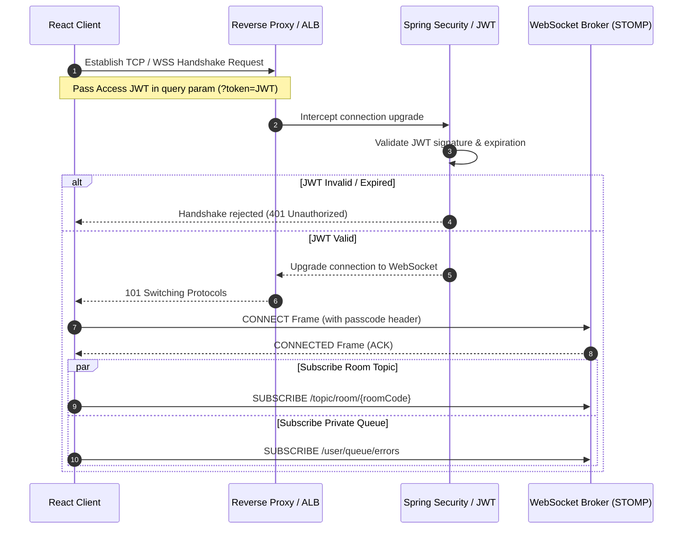
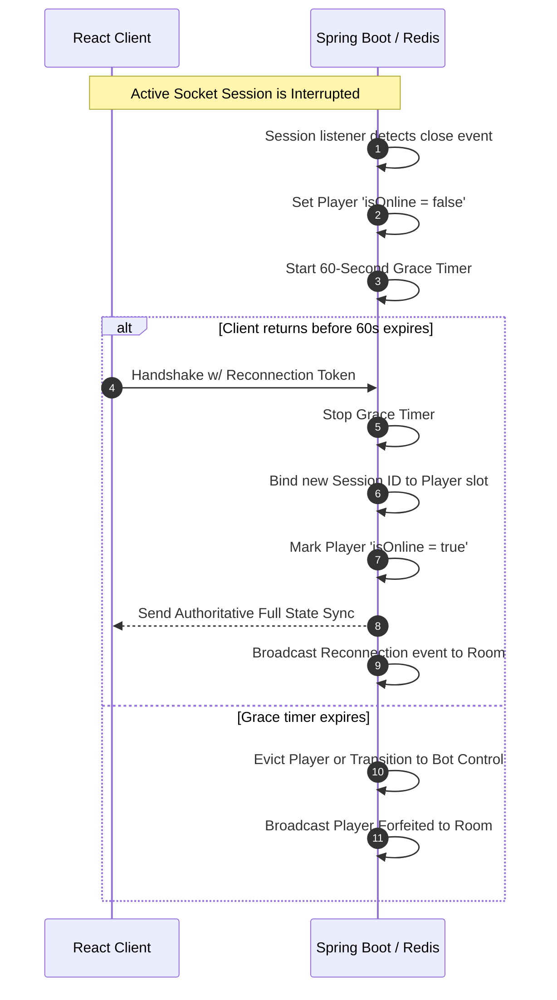

# Production-Grade Ludo Real-Time WebSockets & Event-Driven Protocol Specification
**Document Version:** 1.0.0  
**Status:** PROPOSED / SPECIFICATION  

---

## 1. WebSocket Architecture Overview

Real-time, multiplayer gaming requires sub-100ms bidirectional communication. Standard HTTP REST architectures are fundamentally inadequate for this mode of play:
* **Statelessness & Polling Overhead:** HTTP is stateless. Repeatedly polling the server via GET requests (`/api/matches/{id}/state`) creates a massive volume of redundant header overhead (typically 1–2KB per request) and exhausts thread pools on backend REST containers.
* **Latency Mismatch:** Short-polling introduces structural latency delay equal to half the polling interval. Long-polling blocks thread resources on API gateways, creating severe backpressure.
* **Server Push Limitation:** Games require the server to proactively notify clients of game state changes (e.g., opponent rolled a dice, timeout occurred, token captured). HTTP cannot push messages to client instances without custom Server-Sent Events (SSE) or full WebSocket pipes.

To resolve this, we leverage a **Server-Authoritative WebSockets + STOMP (Simple Text Oriented Messaging Protocol)** topology.

### 1.1 Architecture Topology & Flow
The application treats the client strictly as a rendering engine and user input gateway. The server maintains the single source of truth.

```
       React Frontend (Client)                           Spring Boot / JVM (Server)
+------------------------------------+              +------------------------------------+
|  UI Board Renderer & Audio Hooks   |              |   LudoEngine (Rules Validator)    |
+------------------------------------+              +------------------------------------+
                  |                                                   ^
                  | 1. Action Request                                 | 2. Input validation
                  v (STOMP payload /app)                              | & state transition
+------------------------------------+              +------------------------------------+
|   Zustand Store / WS Client Socket |------------->|   STOMP Session Message Handler    |
+------------------------------------+              +------------------------------------+
                  ^                                                   |
                  | 4. Authoritative Broadcast                        | 3. Write State Cache
                  +---------------------------------------------------+ (Redis & PG Event Log)
                       (STOMP Broadcast /topic)
```

1. **Client Action Request:** The client triggers an action (e.g., clicking the dice). The client publishes a message to a secured `/app` STOMP destination containing the action parameters.
2. **Server-Authoritative Logic:** The Spring Boot backend intercepts the frame, maps the active channel session to the authenticated player color, checks turn phases, runs rules validation via the decoupled engine, and computes the new state.
3. **State Mutation Persistence:** The server commits the game state update to an in-memory Redis cluster (acting as the fast-access session cache) and schedules asynchronous log persistence to PostgreSQL.
4. **Authoritative Broadcast:** The server publishes the updated game state and list of dynamic side-effects to the room topic `/topic/room/{roomCode}`. All subscribed clients (including spectators) consume the payload, update their local Zustand store, and trigger matching UI/audio transitions.

---

## 2. Connection Lifecycle

Managing WebSocket session persistency is crucial for online matchmaking. The lifecycle maps authentication, setup, network drops, and timeouts.

### 2.1 Complete Connection Sequence



### 2.2 Connection States
A user's socket connection transitions through the following lifecycle states:

```
[DISCONNECTED] --(Upgrade request w/ JWT)--> [CONNECTING]
      ^                                            |
      | (Invalid Auth / Handshake Refused)         |
      +--------------------------------------------+
      |
      v
 [CONNECTED] --(Join Match / Subscribe)--> [ACTIVE_PLAY]
      |                                        |
      | (Heartbeat Timeout / Socket Drop)      | (Normal Close)
      v                                        v
 [DISCONNECTED_GRACE]                     [COMPLETED]
      |
      +---(Re-auth & State Sync in <60s)---> [ACTIVE_PLAY]
      |
      +---(Grace Expired / Timeout)--------> [ABANDONED]
```

### 2.3 Disconnection, Timeout, & Forfeiture Rules
1. **Network Interruption (Temporary Disconnect):** If the client socket experiences a heartbeat loss or socket drop:
   - The server marks the player entity status as `isOnline = false` and registers the timestamp.
   - The current turn timer does **not** stop, ensuring that a disconnected player cannot stall the game.
2. **Auto-Roll & Auto-Pass Logic:**
   - If a player is offline or fails to roll within their 15-second turn window, the server automatically rolls the dice (`ROLL_DICE`).
   - If the roll yields valid moves, the server selects the most conservative progress move (or home-entry path) to avoid leaving tokens in vulnerable positions, then advances the turn.
   - If no moves are valid, the turn immediately passes to the next player.
3. **Turn Timeout Accrual & Auto-Forfeiture:**
   - The server tracks consecutive timeouts (`consecutiveTimeoutsCount`) per player.
   - If a player triggers **3 consecutive timeouts** (whether online or offline), the server initiates an automatic forfeiture:
     - The player is marked as `STATUS_RESIGNED` or `STATUS_DISQUALIFIED`.
     - All of the player's active tokens are permanently cleared from the board map and returned to the base yard.
     - The turn proceeds to the next active player, and the user is prevented from sending subsequent game actions.

---

## 3. Room System Architecture

The lobby system coordinates matchmaking and rooms before a match goes live.

### 3.1 Room Life-Cycle States
```
 +--------+      Start Trigger      +----------+
 | LOBBY  | ----------------------> | ACTIVE   |
 +--------+                         +----------+
     |                                   |
     | Abandoned / Empty                 | Turn Timer / Pause Trigger
     v                                   v
 +--------+                         +----------+
 | VOIDED |                         |  PAUSED  |
 +--------+                         +----------+
                                         |
                                         | Win Conditions Met
                                         v
                                    +----------+
                                    |FINISHED  |
                                    +----------+
```

* **LOBBY (WAITING):** The room is initialized. The host is assigned color `RED`. Opponents join and select available colors (`GREEN`, `YELLOW`, `BLUE`). The match cannot begin until minimum player counts are met (2–4 players).
* **ACTIVE (IN_PROGRESS):** The board is initialized. Board state transitions are evaluated exclusively by the game engine.
* **PAUSED:** Triggered if a critical network sync failure occurs or if players request a vote-pause (optional feature). Reconnection grace periods are active.
* **FINISHED:** All tokens of the winning player(s) have reached position `57`. Final stats (captures, timeouts) are compiled, database records are written, and the room is scheduled for eviction.
* **VOIDED:** Room state when all human players disconnect or the host cancels the lobby before start.

### 3.2 Slot Constraints and Spectators
* **Lobby Capacity:** A room enforces a hard limit of `4` active player slots.
* **Lobby Ownership:** The creator of the room holds the Host role. Only the Host can trigger the state change from `LOBBY` to `ACTIVE`. If the Host departs during the lobby phase, room ownership shifts to the next joined player.
* **Spectator Support:** A spectator client subscribes to the channel `/topic/room/{roomCode}` as a read-only listener. The socket handshake recognizes the client profile as a spectator and suppresses actions sent from their session to game-play destinations.

---

## 4. WebSocket Topics and Channels

All real-time communications are routed through specific STOMP topics and user queues.

```
                  +---------------------------------------+
                  |            STOMP Broker               |
                  +---------------------------------------+
                   /         |                 \        \
                  /          |                  \        \
                 v           v                   v        v
  Client inbound destinations:            Server outbound broadcasts:
  [Client -> Server]                      [Server -> Clients]
  /app/room/{roomCode}/create             /topic/room/{roomCode} (Lobby Sync)
  /app/room/{roomCode}/action             /topic/game/{roomCode} (Delta Events)
                                          /user/queue/errors     (Private Errors)
```

### 4.1 Inbound Routing Table (Client $\rightarrow$ Server Actions)

| Destination | Payload Context | Handled By | Authentication | Validation Checked |
| :--- | :--- | :--- | :--- | :--- |
| `/app/room/create` | `{maxPlayers, settings}` | `RoomController` | JWT Session | Checks valid schema settings. |
| `/app/room/{roomCode}/join` | `{userId}` | `RoomController` | JWT Session | Verifies room state is `LOBBY` and slot capacity $\le 4$. |
| `/app/room/{roomCode}/ready` | `{isReady}` | `RoomController` | JWT Session | Verifies player belongs to lobby. |
| `/app/room/{roomCode}/start` | `{}` | `RoomController` | Host Check | Verifies sender matches the creator ID. |
| `/app/game/{roomCode}/roll` | `{}` | `GameActionHandler` | Turn Check | Verifies sender color matches active player color and phase is roll. |
| `/app/game/{roomCode}/move` | `{"tokenIndex": 0-3}` | `GameActionHandler` | Turn Check | Verifies token index is in `availableMoves` list. |

### 4.2 Outbound Routing Table (Server $\rightarrow$ Client Broadcasts)

| Destination | Scope | Payload Description | Frequency |
| :--- | :--- | :--- | :--- |
| `/topic/room/{roomCode}` | Broadcast | Lobby state, join/leave events, readiness status, start configurations. | On player state change during lobby phase. |
| `/topic/game/{roomCode}` | Broadcast | Authoritative game state updates, last dice value, active player, token positions. | On every valid gameplay state transition. |
| `/user/queue/errors` | Private (Client specific) | JSON error payload detailing validation failures, wrong turns, or invalid requests. | On failed checks / exceptions. |

---

## 5. Event Definitions

Every real-time event is typed and documented with validation rules, payload mappings, and failure responses.

### 5.1 Lobby Events

#### `CREATE_ROOM`
* **Sender:** Client (Host)
* **Receiver:** Server
* **Validation Rules:**
  - JWT must be valid.
  - Creator cannot be actively associated with another live room.
* **Success Behavior:** Server registers a 6-character room code in Redis.
* **Response (Broadcast `/topic/room/{roomCode}`):** Returns `ROOM_STATE_UPDATE` payload showing host registered as `PlayerColor = RED`.

#### `JOIN_ROOM`
* **Sender:** Client
* **Receiver:** Server
* **Validation Rules:**
  - Room status must be `LOBBY`.
  - Number of joined players must be $< 4$.
  - Target slot color must not be occupied.
* **Error Response:** Sent to `/queue/errors` (e.g., `LOBBY_FULL`, `ROOM_LOCKED`).
* **Broadcast Behavior:** Public broadcast of updated member listings.

#### `START_GAME`
* **Sender:** Client (Host)
* **Receiver:** Server
* **Validation Rules:**
  - Requester session must match Host session.
  - Active joined player count must be $\ge 2$.
  - All joined players must be in `READY` status.
* **Success Broadcast:** Server initializes the game board configuration and broadcasts the `GAME_STARTED` event with the full game state model.

---

### 5.2 Gameplay Events

#### `ROLL_DICE`
* **Sender:** Client
* **Receiver:** Server
* **Validation Rules:**
  - Requester color must match `activeColor`.
  - Match phase must be `WAITING_FOR_ROLL`.
  - `consecutiveSixesCount` must be $< 3$.
* **Success Response Broadcast:** Server broadcasts the rolled value, computed moves, and consecutive count.
* **Failure Response:** Sent to private user queue (`/queue/errors` - "Not your turn to roll").

#### `MOVE_TOKEN`
* **Sender:** Client
* **Receiver:** Server
* **Validation:**
  - Requester color must match `activeColor`.
  - Match phase must be `WAITING_FOR_MOVE`.
  - Payload `tokenIndex` must match an option in `availableMoves`.
* **Success Broadcast:** Server updates coordinates, processes potential capture kills or home arrivals, recalculates active turns, and publishes the movement vector.

---

### 5.3 Connection & Synchronization Events

#### `PLAYER_DISCONNECTED`
* **Sender:** Server (System Session Listener)
* **Receiver:** All remaining players in room.
* **State Updates:** Player's `isOnline` is set to `false`. Reconnection grace window (60s timer) initialized.

#### `PLAYER_RECONNECTED`
* **Sender:** Client / Server Upgrade Handler
* **Receiver:** All players in room.
* **Validation:** Reconnecting user ID must match the disconnected slot mapping.
* **Success Broadcast:** Stop grace timer. Mark user `isOnline = true`. Push a full `GAME_STATE_UPDATE` to the rejoining client to synchronize client-side components.

---

## 6. Payload Design

Payload communication formats are designed to be concise and serializable, avoiding cyclic entity references.

### 6.1 Generic Event Envelope
All WebSocket payloads are wrapped in a generic STOMP message envelope containing metadata.

```json
{
  "eventId": "f89dc845-a901-49cf-8ef3-239472e389df",
  "eventType": "DICE_ROLLED",
  "timestamp": "2026-05-28T21:20:00.123Z",
  "sequenceNumber": 104,
  "payload": {}
}
```

### 6.2 Specific Payload Schemas

#### Room Payload (Lobby Phase)
```json
{
  "roomCode": "AX89P0",
  "status": "LOBBY",
  "hostId": "d3b07384-d113-49cd-a5d6-8ee5aa5f94ad",
  "settings": {
    "maxPlayers": 4,
    "turnTimerSeconds": 15,
    "killRequiredToEnterHome": true
  },
  "slots": [
    {
      "userId": "d3b07384-d113-49cd-a5d6-8ee5aa5f94ad",
      "displayName": "PlayerOne",
      "color": "RED",
      "isReady": true,
      "isOnline": true
    },
    {
      "userId": "a901f4ef-59df-4c3d-b472-888ef929c49d",
      "displayName": "PlayerTwo",
      "color": "GREEN",
      "isReady": false,
      "isOnline": true
    }
  ]
}
```

#### Dice Roll Payload
```json
{
  "activeColor": "RED",
  "diceValue": 6,
  "consecutiveSixes": 1,
  "validMoves": [
    {
      "tokenIndex": 0,
      "fromPosition": -1,
      "toPosition": 0,
      "isCapture": false,
      "isGoalEntry": false
    },
    {
      "tokenIndex": 1,
      "fromPosition": 12,
      "toPosition": 18,
      "isCapture": true,
      "isGoalEntry": false
    }
  ]
}
```

#### Token Movement Payload
```json
{
  "activeColor": "RED",
  "tokenIndex": 1,
  "movementPath": [12, 13, 14, 15, 16, 17, 18],
  "captureEvent": {
    "capturedColor": "GREEN",
    "capturedTokenIndex": 2,
    "returnedToBase": true
  },
  "isGoalEntry": false,
  "nextPlayer": "RED",
  "nextPhase": "WAITING_FOR_ROLL"
}
```

#### Complete Game State Sync Payload
Used for initial load and full reconnection recovery:
```json
{
  "matchId": "c92842e4-921d-4bc3-90d4-aefc90ee9bc4",
  "status": "ACTIVE",
  "activeColor": "GREEN",
  "turnPhase": "WAITING_FOR_MOVE",
  "lastRoll": 5,
  "consecutiveSixesCount": 0,
  "timerRemaining": 11,
  "players": {
    "RED": {
      "userId": "d3b07384-d113-49cd-a5d6-8ee5aa5f94ad",
      "isOnline": true,
      "tokens": [
        { "index": 0, "position": 18, "status": "TRACK", "isSafe": false },
        { "index": 1, "position": 57, "status": "HOME", "isSafe": true },
        { "index": 2, "position": -1, "status": "BASE", "isSafe": false },
        { "index": 3, "position": -1, "status": "BASE", "isSafe": false }
      ]
    },
    "GREEN": {
      "userId": "a901f4ef-59df-4c3d-b472-888ef929c49d",
      "isOnline": true,
      "tokens": [
        { "index": 0, "position": 13, "status": "TRACK", "isSafe": true },
        { "index": 1, "position": 25, "status": "TRACK", "isSafe": false },
        { "index": 2, "position": -1, "status": "BASE", "isSafe": false },
        { "index": 3, "position": -1, "status": "BASE", "isSafe": false }
      ]
    }
  }
}
```

---

## 7. Multiplayer Synchronization Model

### 7.1 Authoritative Game State
The frontend is strictly client-side presentation:
* **Zero Optimistic Prediction:** For dice rolls, there is no client-side prediction. The client triggers the roll request and displays a generic spinning animation until the authoritative `DICE_ROLLED` event arrives.
* **Token Movement Pathing:** For token movements, the client computes local path arrays only after the backend validates the action and publishes the validated `movementPath`. This ensures that coordinate shifts, capture vectors, and goal transitions are completely synchronized.

### 7.2 State Reconciliation & Logical Clocks
To guarantee that messages are evaluated in the correct sequence across clients experiencing network jitter:
* Every state transition published by the server increments a `sequenceNumber` logical clock.
* The client maintains a local `lastProcessedSequence` integer.
* If a state update arrives with `sequenceNumber = current + 1`, it is applied.
* If it is higher (`sequenceNumber > current + 1`), a packet drop has occurred. The client immediately queues a request to `/app/game/resync` to pull the complete state sync.
* If a message arrives with `sequenceNumber <= current`, the packet is discarded as a duplicate.

### 7.3 Concurrency & Action Guarding
To prevent race conditions (such as two players executing actions simultaneously, or a user clicking double inputs):
* **Turn Locking:** The backend game engine maintains a thread-safe mutex lock for each active room cache block in Redis.
* **Transition State:** During resolution of a state change, the server marks the phase as `RESOLVING`. Any incoming action request during `RESOLVING` is immediately dropped with a fast-fail error.
* **Sequence Tracking:** If Player A sends a `MOVE_TOKEN` action but the active player turns to Player B before the packet is received, the server rejects Player A's action due to a turn validation mismatch.

---

## 8. Anti-Cheat Architecture

In multiplayer systems, the client environment is untrusted. Our architecture implements defensive validations at every execution step:

```
               Client Action Request (Unverified)
                           |
                           v
             +---------------------------+
             | JWT Session Authorization | -> Rejects spoofed credentials
             +---------------------------+
                           |
                           v
             +---------------------------+
             | Turn Sequence Validation  | -> Rejects actions sent out-of-turn
             +---------------------------+
                           |
                           v
             +---------------------------+
             |  Rules Engine Validation  | -> Rejects impossible paths
             +---------------------------+
                           |
                           v
                 Authoritative State Mutated
```

### 8.1 Core Security Principles
* **Server-Side Dice Generation:** The client has no influence over dice values. The client transmits a blank `ROLL_DICE` request. The server generates the dice value using secure pseudo-random generators (`java.security.SecureRandom`) and updates the state cache.
* **Validation Pipeline:**
  - *Move Distance Verification:* The server tracks every token's current coordinates. When a `MOVE_TOKEN` request arrives, the server checks the token index, matches its current position, calculates the path length based on `lastRoll` cached in the database/Redis, and validates that it does not exceed home limits.
  - *Coordinate Audits:* The server enforces boundaries (`-1` through `57`). A client cannot send coordinates (e.g., `position = 45`); it can only request the movement of a token index.
* **Throttling & Duplicate Packet Prevention:**
  - *Rate Limiting:* A client cannot roll the dice more than once per phase. A sliding-window rate limiter blocks players who transmit actions faster than the round allows.
  - *Replay Attack Guards:* Every action contains a transaction UUID. The server keeps a sliding cache of recent transaction IDs. If a duplicate ID is received, the action is discarded.

---

## 9. Game State Broadcasting Strategy

To balance network usage and responsiveness, the engine combines **delta updates** with **full synchronization**.

```
   State Transition           Sync Method              Packet Size
+--------------------+   ----------------------   -------------------
|  Dice rolled /     |   Delta Event Broadcast     ~ 200 - 400 Bytes
|  Token advanced    |   (Only changed fields)
+--------------------+
          |
          v
+--------------------+   ----------------------   -------------------
|  Reconnection /    |   Full State Sync          ~ 1.5 - 3.0 Kilobytes
|  Sequence Gap      |   (Complete room config)
+--------------------+
```

### 9.1 Delta Event Broadcasting (Default)
For standard gameplay transitions, the server publishes only the delta payload (e.g., `movedTokenIndex`, `movementPath`, `nextPlayerTurn`, `lastRoll`).
* **Optimization:** Minimizes packet sizes to 200–400 bytes, reducing bandwidth consumption for thousands of active matches.

### 9.2 Full State Synchronization (Fallback)
A full game state dump is transmitted only in the following scenarios:
* **Initial Loading:** A player first enters the `GameRoom` view.
* **Reconnection:** A client returns from an offline state.
* **Sequence Gap Error:** A client reports a sequence gap, indicating missing packets.

---

## 10. Reconnect and Recovery System

Our state recovery system relies on **stateless servers** and **session serialization** to recover from network drops.

### 10.1 Recovery Token Mechanics
1. During the initial room entry, the server generates a cryptographically signed **Reconnection Token** mapped to the player's session and sends it to the user.
2. If the user disconnects, this token is stored in the client's session state.
3. Upon reconnection, the client issues a REST request or WebSocket frame containing the Reconnection Token.
4. The server validates the token against Redis, binds the new WebSocket session ID to the historical game slot, and retrieves the game state.

### 10.2 Disconnection State Restoration Flow



---

## 11. Error Handling System

If validation fails, the server must reject the client request, log the incident, and restore synchronization.

### 11.1 WebSocket Error Structure
All network errors are returned in a standard structure via the user's private queue `/user/queue/errors`:

```json
{
  "errorCode": "RULE_VIOLATION_ILLEGAL_MOVE",
  "errorMessage": "Requested movement target exceeds home goal boundary.",
  "timestamp": "2026-05-28T21:21:00.456Z",
  "referenceAction": "MOVE_TOKEN",
  "sequenceExpectation": 108
}
```

### 11.2 Common Error Code Index

| Error Code | Reason | Resolution Strategy |
| :--- | :--- | :--- |
| `WRONG_TURN_PHASE` | Player rolled when phase was `WAITING_FOR_MOVE`. | Reject action, force-send the cached valid moves list. |
| `INVALID_PLAYER_TURN` | Player sent roll request out of turn. | Reject action silently, do not broadcast. |
| `ROOM_NOT_FOUND` | User attempted to join an expired invite code. | Close socket connection with code `4404`. |
| `EXPIRED_JWT_SESSION` | User session token expired during play. | Disconnect client, redirect to login path. |
| `STATE_DESYNC_GAP` | Client sequence number lags backend. | Trigger full sync update payload. |

---

## 12. Scalability Considerations

To support thousands of concurrent active matches, the backend isolates logic and resources.

```
       Client Socket Requests                   State Cache Tier
+------------------------------------+      +----------------------+
| Spring Boot WS Node 1 (State-free) | <--> |                      |
+------------------------------------+      |    Redis Cluster     |
                                            | (Shared Room States) |
+------------------------------------+      |                      |
| Spring Boot WS Node 2 (State-free) | <--> |                      |
+------------------------------------+      +----------------------+
                                                       ^
                                                       | Sync Log (Async)
                                                       v
                                            +----------------------+
                                            | PostgreSQL Database  |
                                            +----------------------+
```

### 12.1 Room State Isolation
* **In-Memory States:** During play, active game states are not read or written to PostgreSQL on every action. Instead, the serialized state is stored in Redis.
* **Eviction Policies:** Upon match completion, the final state is written to PostgreSQL (for dashboard stats and match history logs), and the Redis cache key is scheduled for eviction after 5 minutes.

### 12.2 Session Management & Horizontal Scaling
* **Stateless WS Gateways:** The Spring Boot backend instances do not store game state inside local RAM.
* **Shared Redis Broker:** STOMP instances utilize a Redis Pub/Sub message broker backend. If Player 1 is connected to Gateway Node A and Player 2 is connected to Gateway Node B, the broker routes the broadcasts across nodes.
* **Sticky Sessions:** ALBs route socket reconnections back to the origin gateway instances when possible to minimize authentication handshake overhead.

---

## 13. Security Design

We implement security controls at the handshake and transport layers.

* **JWT WebSocket Handshake:** Since WebSocket connections cannot parse custom HTTP headers (such as `Authorization: Bearer <JWT>`) during the initial HTTP upgrade request in some client runtimes, the token is passed in a secure query string or WebSocket protocol sub-header. The server parses and validates this token before finalizing the handshake.
* **Channel Access Controls:**
  - When a client subscribes to `/topic/room/{roomCode}` or `/topic/game/{roomCode}`, the server evaluates whether the user's authenticated ID is registered in that room's database slot.
  - Subscriptions to unauthorized channels are blocked.
* **Dynamic Event Throttling:**
  - Real-time connection handlers log the frequency of incoming packets per socket session.
  - If a user sends more than 10 requests per second, the server flags the session, sends a warning, and eventually drops the connection to prevent DDoS attacks.

---

## 14. Event Flow Diagrams

### Example 1: Player Creates Room
```
Player Client (RED)                     Server Gateways                   Database/Redis
       |                                       |                                 |
       |--- POST /api/rooms/create ----------->|                                 |
       |    (Settings, JWT)                    |--- Generate Invite Code ------->|
       |<-- 201 Created (AX89P0, Settings) ----|    (Store room details)         |
       |                                       |                                 |
       |--- WS Connect & Handshake ----------->|                                 |
       |<-- WS Connected (ACK) ----------------|                                 |
       |                                       |                                 |
       |--- SUBSCRIBE /topic/room/AX89P0 ----->|                                 |
       |<-- Broadcast: ROOM_STATE_UPDATE ------|                                 |
```

### Example 2: Player Joins Room
```
Player Client (GREEN)                    Server Gateways                   Database/Redis
       |                                       |                                 |
       |--- GET /api/rooms/join/AX89P0 ------->|                                 |
       |    (JWT)                              |--- Validate Slot Capacity ----->|
       |<-- 200 OK (Assign GREEN Slot) --------|                                 |
       |                                       |                                 |
       |--- WS Connect & Handshake ----------->|                                 |
       |<-- WS Connected (ACK) ----------------|                                 |
       |                                       |                                 |
       |--- SUBSCRIBE /topic/room/AX89P0 ----->|                                 |
       |<-- Broadcast: PLAYER_JOINED (GREEN) --|                                 |
```

### Example 3: Dice Roll Flow
```
Active Player (RED)                      Server Gateways                   Database/Redis
       |                                       |                                 |
       |--- SEND /app/game/AX89P0/roll ------->|                                 |
       |                                       |--- Lock Room Mutex ------------>|
       |                                       |--- Check Turn Phase (Valid)     |
       |                                       |--- Generate Dice Value (Secure) |
       |                                       |--- Calculate Valid Moves        |
       |                                       |--- Save Game State ------------>|
       |                                       |--- Unlock Room Mutex ---------->|
       |<-- Broadcast: DICE_ROLLED ------------|                                 |
       |    (Value, ValidMoves, Seq: 104)      |                                 |
```

### Example 4: Token Movement Flow
```
Active Player (RED)                      Server Gateways                   Database/Redis
       |                                       |                                 |
       |--- SEND /app/game/AX89P0/move ------->|                                 |
       |    (TokenIndex: 0)                    |--- Lock Room Mutex ------------>|
       |                                       |--- Validate Path & Distance     |
       |                                       |--- Check Captures / Home Goals  |
       |                                       |--- Mutate Positions             |
       |                                       |--- Save Game State ------------>|
       |                                       |--- Unlock Room Mutex ---------->|
       |<-- Broadcast: TOKEN_MOVED ------------|                                 |
       |    (Path, NextPlayer, Seq: 105)       |                                 |
```

### Example 5: Player Disconnect and Reconnect Flow
```
Reconnecting Player (RED)                Server Gateways                   Database/Redis
       |                                       |                                 |
       |xxx Socket Disruption (Disconnect) xxxx|                                 |
       |                                       |--- Detect Disconnection         |
       |                                       |--- Mark Player Offline          |
       |                                       |--- Initialize Grace Timer ------>|
       |                                       |                                 |
       |--- WS Reconnect (JWT) --------------->|                                 |
       |    (Pass Recovery Token)              |--- Validate Recovery Token ---->|
       |                                       |--- Clear Grace Timer ----------->|
       |                                       |--- Bind session ID              |
       |<-- WS Connected (ACK) ----------------|                                 |
       |                                       |                                 |
       |--- SUBSCRIBE /topic/room/AX89P0 ----->|                                 |
       |<-- Direct Send: GAME_STATE_UPDATE ----|                                 |
       |    (Full State Recovery Sync)         |                                 |
       |<-- Broadcast: PLAYER_RECONNECTED -----|                                 |
```

---

## 15. Best Practices

* **Immutable State Updates:** The server-side rules engine returns a new state object on every transition. State mutations do not modify reference pointers in memory, preventing dirty reads across concurrent threads.
* **Separation of Concerns:** Keep network serialization logic (DTO mapping, JSON serialization) out of the game rules calculator. The game rules engine should process raw logical models.
* **WebSockets Debugging Strategy:**
  - Leverage browser DevTools WebSocket frames inspectors to view raw STOMP text streams.
  - Implement a dedicated dev controller endpoint (`/api/dev/rooms/{roomCode}/state`) to retrieve the current server state cache as a JSON payload for visual testing.
* **Logging Principles:**
  - Log game exceptions (e.g., illegal moves) at the `WARN` level. They indicate either network synchronization lag or client-side validation tampering.
  - Avoid logging dice values or full state dumps at the `INFO` level to prevent log pollution. Use `DEBUG` level logging with clean serialization tools instead.
